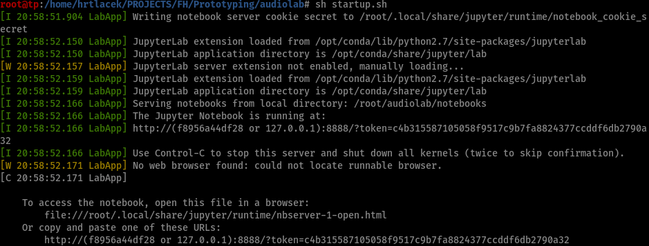

# Audiolab

A docker based DSP learning/Experimentation environment inculdig:

- Jupyter lab
- FAUST
- python 3.7 (at the moment. Depends on miniconda3 docker image)
- FAUSTpy to run FAUST code inside jupyter
- [faustWidgets](https://github.com/hrtlacek/faustWidgets) (to interactively control FAUST code )
- librosa (for MIR and feature extraction)
- scipy, pandas, numpy for general data science
- sox & ffmpeg

### Why docker?
Docker is something like a virtual machine ([well it's not](https://devopscon.io/blog/docker/docker-vs-virtual-machine-where-are-the-differences/)). What we get is a linux machine that has all tools already installed that we need to explore DSP development with python and FAUST. This has many advantages in a teaching context:

- Students don't need to install anything weird to their system (except docker), 
- they cannot really mess up their system 
- if something breaks one can just reinstall the docker image.
- all students have the same tools at their hands
- some Linux experience for everyone
  

## Install

The installation requires [docker desktop](https://www.docker.com/get-started). So first install that.

### Mac/Linux
- download or clone the repository
- open a terminal
- change to the directory that you downloaded (`cd ~/Downloads/audiolab` for example) 
- run `sh build.sh`

### Windows

TODO

## Test if everything is working

### Mac/Linux
- download or clone the repository
- open a terminal
- change to the directory that you downloaded (`cd ~/Downloads/audiolab` for example) 
- run `sh startup.sh`
something similar to what is shown in the image below should appear

follow the instructions that are printed out (`copy and paste this URL:
        http://127.0.0.1:8888/?token=c4b315587105058f9517c9b7fa8824377ccddf6db2790a32`) 
your token will be different. 

